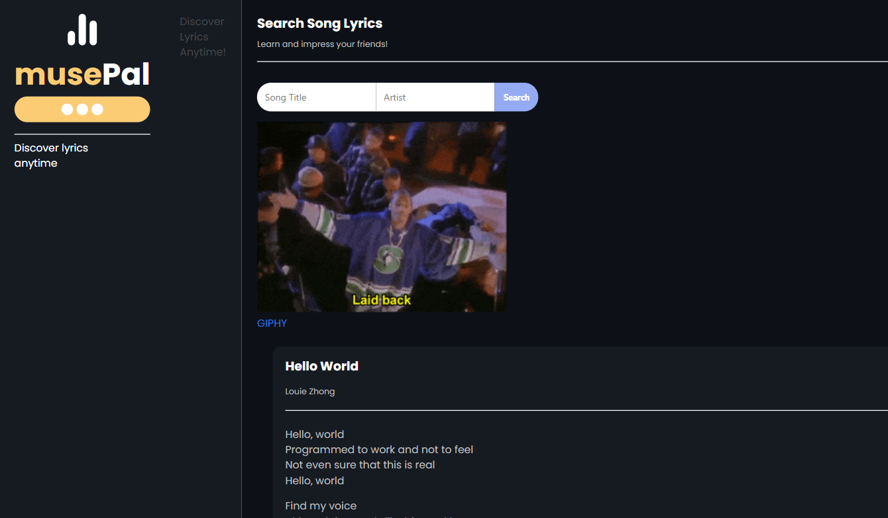
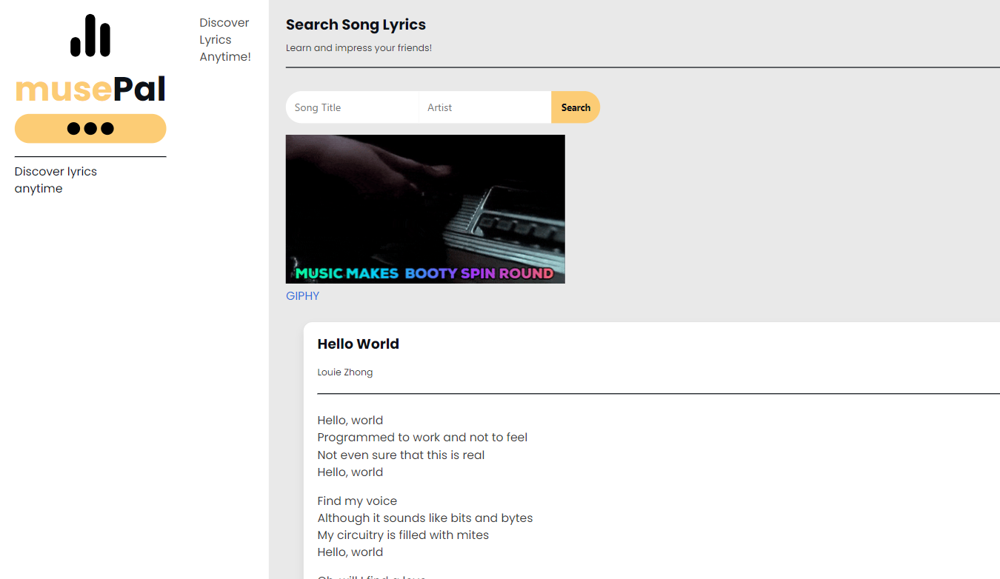
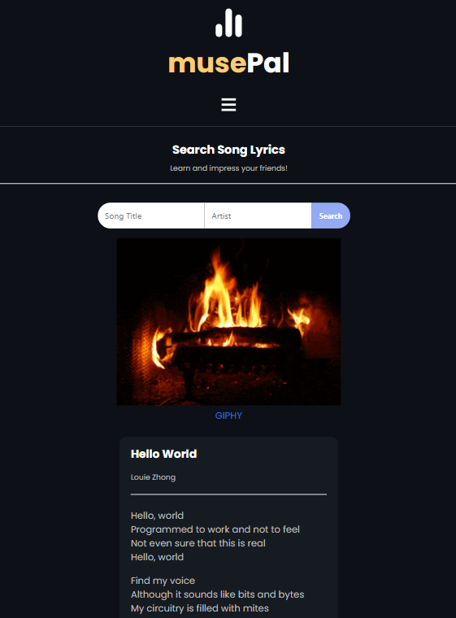
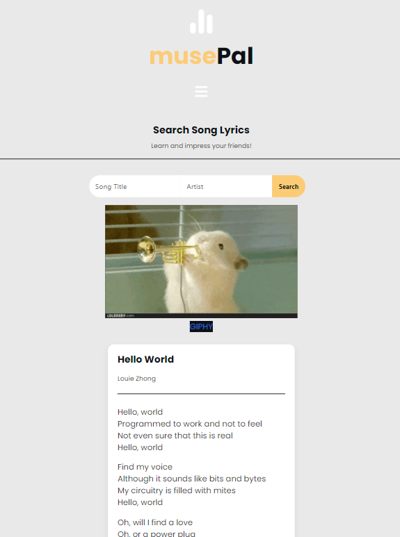

# MusePal

Your friend in the music world.
### Website

https://mavila6.github.io/muse-pal/

## Description

MusePal is a modern music app that lets you search a song and returns the lyrics of the song with an associated GIF. This app provides a platform for music lovers to explore the complexities of their favorite songs. Have you ever had a song stuck in your head but can’t think of the lyrics? Check out MusePal.

### User Story

AS A music and Giphy lover. I WANT an app that will allow me to search lyrics and associated gifs. SO THAT I can explore song complexities.

### Built With

#### Programming Languages

<a href="https://www.w3schools.com/css/default.asp" target="_blank">
<a href="https://www.javascript.com/" target="_blank">

#### Frameworks and Libraries

<a href="https://api.jquery.com/" target="_blank">

#### Design

<a href="https://www.figma.com/" target="_blank">

#### IDEs/Editors

<a href="https://code.visualstudio.com/" target="_blank">

#### Version Control

<a href="https://git-scm.com/" target="_blank">
<a href="https://github.com/" target="_blank">

### Screenshots

  
### Credits

Giphy API: https://developers.giphy.com/
  
Lyrics API: https://lyricsovh.docs.apiary.io/
  
## Contribution

David Lopez - Samantha Malone - Marco Avila

&copy; 2021 Quatro
